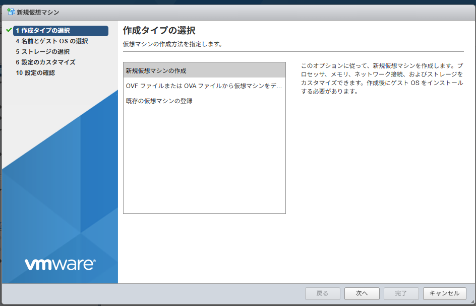
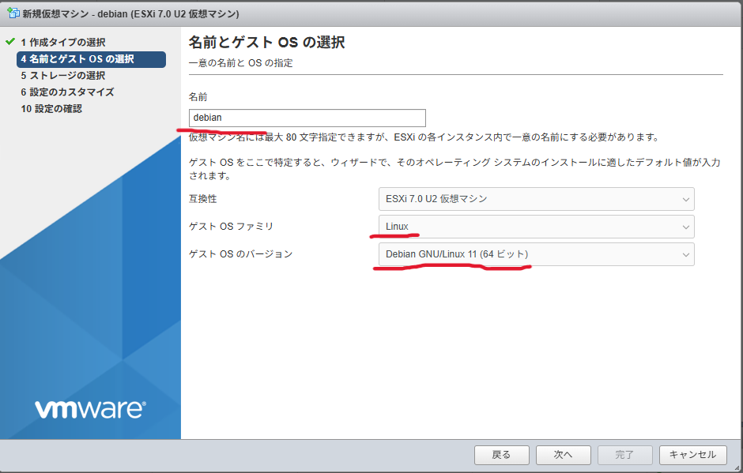
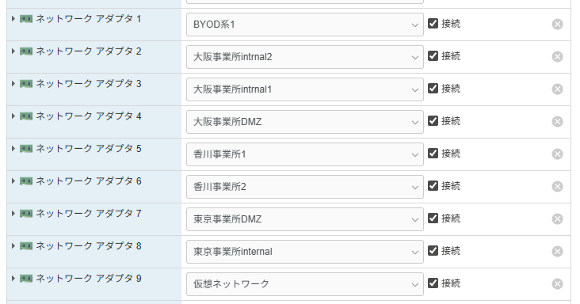

# ESXiでLinuxをセットアップ

## 仮想マシンの作成
### 0.作成ウィザードへ飛ぶ

:::note メモ
ナビゲーターが表示されてなかったら左側に隠れちゃってるので押して開いてください
:::

## 1.作成タイプの選択

新規仮想マシンの作成を選択

## 2.名前とゲストOSの選択

名前 : 仮想マシンの名前(自分で自分のだとわかる名前つけてね)

ゲストOSファミリ : Linux

OSのバージョン　: debian 11 64bit

## 3.ストレージの選択
そのままでok

## 4.設定の確認 

- ネットワークアダプタ1 internet

- CD/DVDデバイス
ホストデバイス→データストアISOファイル
debian-12.11.0-amd64-BD-1.isoを選んで選択

:::warning 警告
インターネットインストールできる体で進めますが、
もしダメだった時のリカバリが効かないので頼むからブルーレイ版をぶち込んでください
:::

## おまけ
### インターネットアダプターの仕様
- 仮想スイッチにポートグループをはやして使う

- 仮想スイッチには仮想化ソフトをホスティングしてるPCについてる物理的なアダプターをつけることもできるがなくても使える
    - ないとインターネットない状態で仕事ができます!!!!!!!!!!!
    - よろこべ!!!!!!!

- なので若年者の大会環境では物理アダプタ抜きローカルネットワークで生きることになります。
    - 今回はどこまで進めるか全く未知数なのでその場でどうにかします

- いっぱいインターネットアダプターつけれるので幸せ
↓現状実現可能な最終形態はこちら

