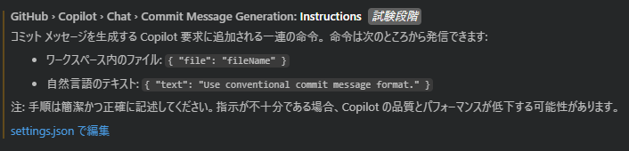

# VSCodeのGithubCopilotにGitのコミットメッセージを書かせて楽したーい

VSCodeでGitの操作ができるのは周知の事実として、Gitのコミットメッセージをコミットメッセージを入れるテキストボックス横にあるキラキラボタンを押して生成できることを知らない人がいらっしゃる…かも?

コミットメッセージをこの機能で生成すると勝手に英語にしたりわざわざ[Conventional Commits](https://www.conventionalcommits.org/ja/v1.0.0/)にしたがって書いてたのに破ったりと結構やらかしてくれる。それならGPTみたいにカスタム指示的なもので調整したいのでその方法をまとめちゃうぞ

## VSCodeの設定画面を開くぞ！


この設定を見つければok

`setting.json`をひらいて、下に提示し設定をGitHubCopilotにぶち込んでもらうだけでOK
```json
    "github.copilot.chat.commitMessageGeneration.instructions": [

        {
            "text": "必ず日本語で記述してください"
        },
        {
            "text": "コミットメッセージは、最初にConventional Commitsに則って記述してください"
        },
        {
            "text": "その後ファイルごとの詳細な変更内容を記述してください"
        }
    ],
```

そうして生成してみると
```
feat: TeraTerm接続設定ファイルの説明を追加

intro.mdにttlファイルがTeraTarmの接続設定ファイルであることを明記しました。
```
こんな感じに今までよりもきれいに形式化されて返してもらえますやった～
